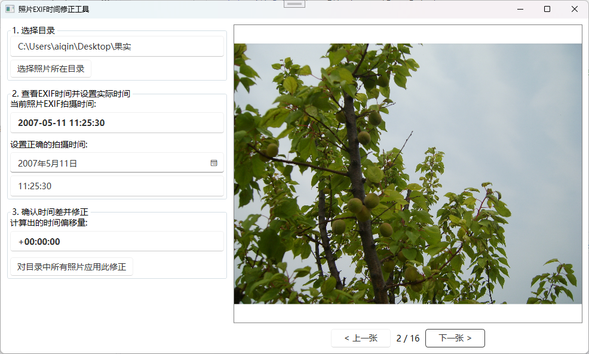

# 照片EXIF时间修正工具 (Photo EXIF Info Fix Tool)

一个简单的WPF桌面应用程序，用于批量修正因相机设置错误等原因导致的照片EXIF拍摄时间不准的问题。

---

## 📸 应用截图



## 🚀 如何使用

1.  **选择目录**: 点击“选择照片所在目录”按钮，选择您要修正的照片所在的文件夹。
2.  **预览与设置**: 
    - 程序会自动加载第一张照片并显示其EXIF时间。
    - 您可以使用“上一张”和“下一张”按钮来浏览照片，找到一张您能记起准确拍摄时间的照片。
    - 在“设置正确的拍摄时间”区域，通过日期选择器和时间输入框（格式 `HH:mm:ss`）来输入这张照片的 **实际拍摄时间**。
3.  **确认偏移量**: 程序会自动计算并显示“时间偏移量”。请确认这个值是否符合您的预期（例如，“+8小时0分钟0秒”或“-2天...”)。
4.  **应用修正**: 点击“对目录中所有照片应用此修正”按钮。
5.  **最终确认**: 在弹出的警告窗口中点击“是”，程序将开始批量修改目录下所有照片的EXIF时间。请耐心等待完成提示。

**重要提示**: 此操作会直接修改原始文件，建议在操作前对您的照片进行备份！

## 🛠️ 从源码构建

本项目使用 .NET 9 和 WPF 构建。

1.  **环境要求**:
    - [.NET 9 SDK](https://dotnet.microsoft.com/download/dotnet/9.0) 或更高版本。
    - Visual Studio 2022 或其他支持 .NET 项目的IDE。

2.  **构建步骤**:
    ```bash
    # 克隆仓库
    git clone https://github.com/your-username/PhotoInfoFix.git
    cd PhotoInfoFix

    # 还原依赖并构建项目
    dotnet build -c Release
    ```
3.  **运行**: 构建成功后，可执行文件位于 `PhotoInfoFix/bin/Release/net9.0-windows/PhotoInfoFix.exe`。
